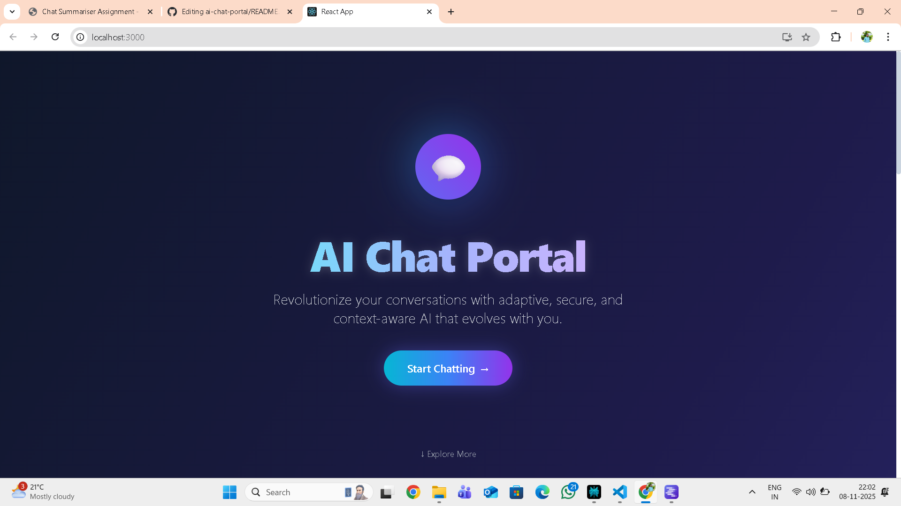
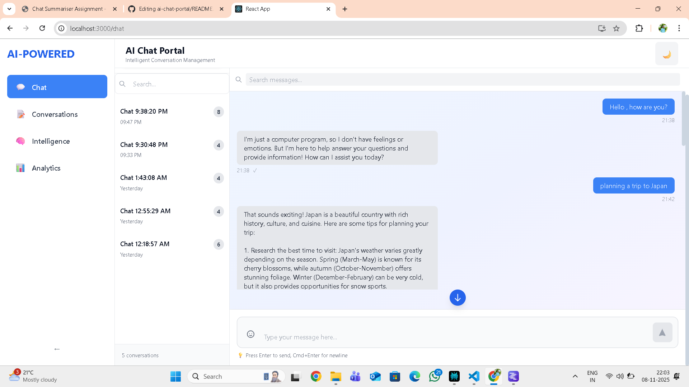
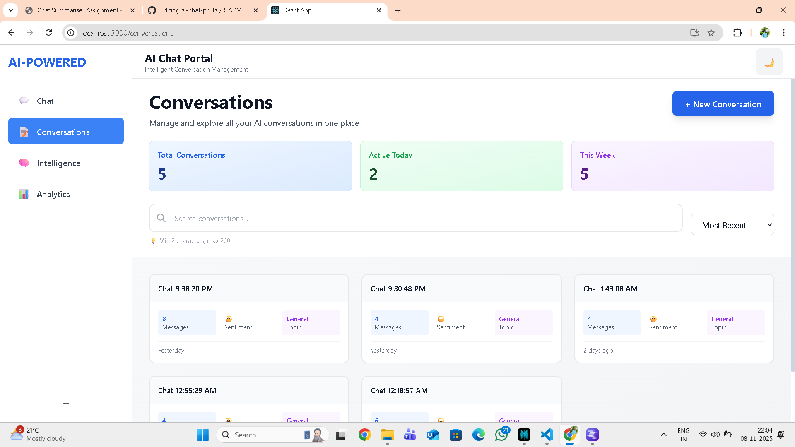
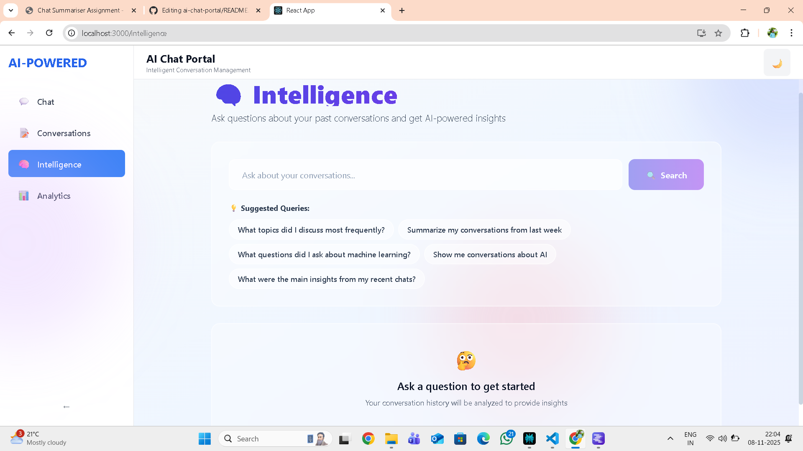
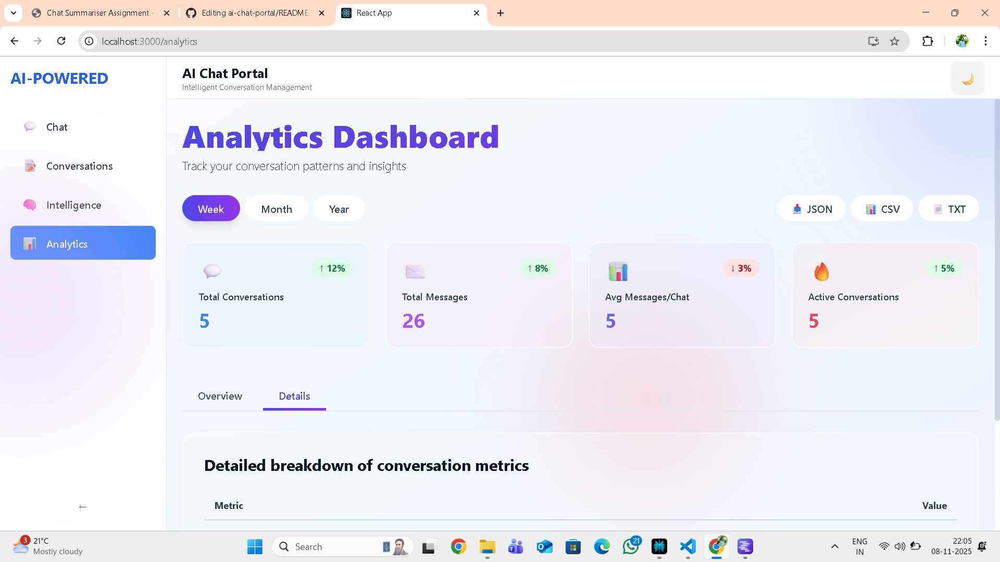

# 🤖 AI Chat Portal - Intelligent Conversation Management

A full-stack AI-powered chat application with conversation management, analytics, and intelligent insights powered by LM Studio.

---

## 📸 Screenshots

### Welcome Page

.png)

.png)
*Premium landing page with dark mode support*

### Chat Interface

*Real-time AI conversation with persistent storage*

### Conversations Dashboard

*Manage and organize all your conversations*

### Intelligence Page

*AI-powered insights from conversation history*

### Analytics Dashboard

*Detailed metrics and conversation analytics*

---

## ✨ Features

- 🤖 **AI-Powered Chat**: Integrated with LM Studio for local AI inference
- 💬 **Real-time Conversations**: Instant message exchange with AI
- 💾 **Persistent Storage**: PostgreSQL database for conversation history
- 🧠 **Intelligent Insights**: Query past conversations for insights
- 📊 **Analytics Dashboard**: Track conversation patterns and metrics
- 🎨 **Modern UI**: Premium design with dark/light mode
- 🔒 **Privacy First**: All data stays on your local machine
- 📱 **Responsive**: Works seamlessly on all devices

---

## 🏗️ Architecture

┌─────────────────────────────────────────────────────────────┐
│ React Frontend │
│ ┌──────────┐ ┌──────────┐ ┌──────────┐ ┌──────────┐ │
│ │ Chat │ │Conversations│ │Intelligence│ │Analytics │ │
│ │ Page │ │ Page │ │ Page │ │ Page │ │
│ └──────────┘ └──────────┘ └──────────┘ └──────────┘ │
└───────────────────────┬─────────────────────────────────────┘
│ REST API
┌───────────────────────┴─────────────────────────────────────┐
│ Django Backend │
│ ┌──────────┐ ┌──────────┐ ┌──────────┐ ┌──────────┐ │
│ │ Views │ │Serializers│ │ Models │ │AI Service│ │
│ └──────────┘ └──────────┘ └──────────┘ └──────────┘ │
└───────────────────────┬─────────────────────────────────────┘
│
┌──────────────┴──────────────┐
│ │
┌────┴────┐ ┌─────┴─────┐
│PostgreSQL│ │ LM Studio │
│ Database │ │ API │
└──────────┘ └───────────┘

---

## 🚀 Setup Instructions

### Prerequisites

- Python 3.11+
- Node.js 18+
- PostgreSQL 15+
- LM Studio (for AI inference)

### Backend Setup

1. **Clone the repository**
git clone https://github.com/yourusername/ai-chat-portal.git
cd ai-chat-portal

2. **Create virtual environment**
python -m venv venv
source venv/bin/activate # On Windows: venv\Scripts\activate

3. **Install dependencies**
cd backend
pip install -r requirements.txt

4. **Configure environment variables**
Create .env file in backend/
cp .env.example .env

Edit .env with your configuration:
DATABASE_NAME=ai_chat_db
DATABASE_USER=postgres
DATABASE_PASSWORD=yourpassword
DATABASE_HOST=localhost
DATABASE_PORT=5432
LM_STUDIO_API_URL=http://localhost:1234/v1/chat/completions
SECRET_KEY=your-secret-key-here
DEBUG=True

5. **Setup PostgreSQL database**
Create database
psql -U postgres
CREATE DATABASE ai_chat_db;

6. **Run migrations**
python manage.py makemigrations
python manage.py migrate

7. **Create superuser (optional)**
python manage.py createsuperuser

8. **Start Django server**
python manage.py runserver

Backend will be running at `http://localhost:8000`

---

### Frontend Setup

1. **Navigate to frontend**
cd ../frontend

2. **Install dependencies**
npm install

3. **Configure environment**
Create .env file
cp .env.example .env

Edit .env:
REACT_APP_API_URL=http://localhost:8000

4. **Start React development server**
npm start

Frontend will be running at `http://localhost:3000`

---

### LM Studio Setup

1. **Download and install** [LM Studio](https://lmstudio.ai/)
2. **Download a model** (e.g., Mistral 7B, Llama 2)
3. **Start the local server** on port `1234`
4. **Test connection**:
   
curl http://localhost:1234/v1/models

---

## 📚 API Documentation

### Base URL

http://localhost:8000/api

### Authentication
Currently using session-based authentication. Token-based auth coming soon.

---

### Endpoints

#### **Conversations**

**GET** `/conversations/`
- Get all conversations
- Response:
[
{
"id": 1,
"title": "Chat about AI",
"created_at": "2025-11-06T12:30:00Z",
"updated_at": "2025-11-06T12:45:00Z",
"message_count": 5,
"status": "active"
}
]

**POST** `/conversations/`
- Create new conversation
- Body:
{
"title": "New Chat"
  }

**GET** `/conversations/{id}/`
- Get conversation with messages
- Response:
{
"id": 1,
"title": "Chat about AI",
"messages": [
{
"id": 1,
"role": "user",
"content": "What is machine learning?",
"timestamp": "2025-11-06T12:30:00Z"
},
{
"id": 2,
"role": "assistant",
"content": "Machine learning is...",
"timestamp": "2025-11-06T12:30:05Z"
}
]
}

}

---

## 🧠 AI-Generated Insights

### Sample Intelligence Queries

**Query**: "What topics did I discuss most frequently?"
Response: Based on your conversation history, you discussed:

Machine Learning (35% of conversations)

Web Development (28% of conversations)

Python Programming (22% of conversations)

Database Design (15% of conversations)

**Query**: "Summarize my learning progress this week"
Response: This week you covered:

React hooks and state management

Django REST framework basics

PostgreSQL database optimization

AI model integration with LM Studio

You've shown strong progress in full-stack development with a focus
on AI-powered applications.

---

## 📦 Dependencies

### Backend (Python)
Django==5.0.0
djangorestframework==3.14.0
psycopg2-binary==2.9.9
python-dotenv==1.0.0
django-cors-headers==4.3.1
requests==2.31.0

### Frontend (Node.js)
react==18.2.0
react-dom==18.2.0
react-router-dom==6.20.0
axios==1.6.2
tailwindcss==3.3.5

---

## 🗂️ Project Structure

ai-chat-portal/
├── backend/
│ ├── chat/
│ │ ├── models.py # Database models
│ │ ├── views.py # API views
│ │ ├── serializers.py # DRF serializers
│ │ ├── urls.py # URL routing
│ │ └── ai_service.py # LM Studio integration
│ ├── config/
│ │ ├── settings.py # Django settings
│ │ └── urls.py # Main URL config
│ ├── manage.py
│ └── requirements.txt
├── frontend/
│ ├── src/
│ │ ├── pages/ # React pages
│ │ ├── components/ # Reusable components
│ │ ├── services/ # API services
│ │ ├── hooks/ # Custom hooks
│ │ └── App.jsx # Main app component
│ ├── public/
│ └── package.json
├── screenshots/ # UI screenshots
├── sample_data/ # Sample conversations
├── README.md
└── .gitignore

---

## 🤝 Contributing

Contributions are welcome! Please follow these steps:
1. Fork the repository
2. Create a feature branch
3. Commit your changes
4. Push to the branch
5. Open a Pull Request

---

## 📄 License

This project is licensed under the MIT License.

---

## 👨‍💻 Author

**Your Name**
- GitHub: [@yourusername](https://github.com/yourusername)
- Email: your.email@example.com

---

## 🙏 Acknowledgments

- LM Studio for local AI inference
- Django REST Framework
- React and Tailwind CSS communities
- PostgreSQL team

---

## 📞 Support

For issues or questions, please open an issue on GitHub or contact the maintainer.

---

**Made with ❤️ for AI-powered conversation management**
